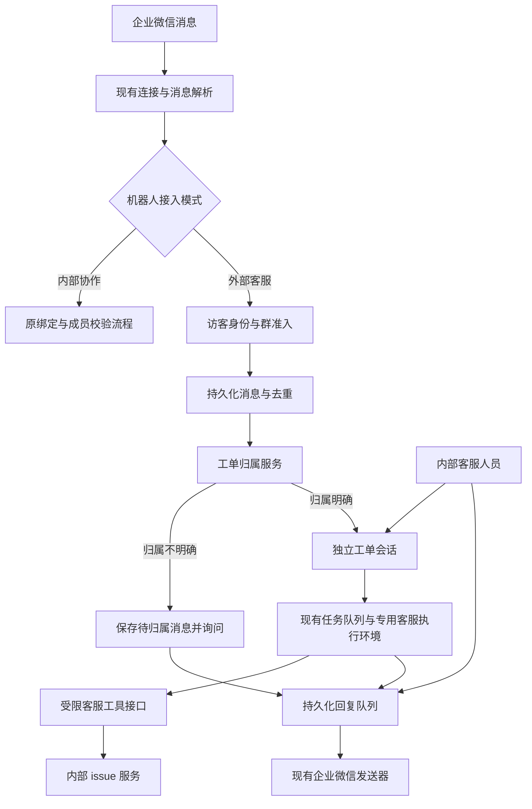
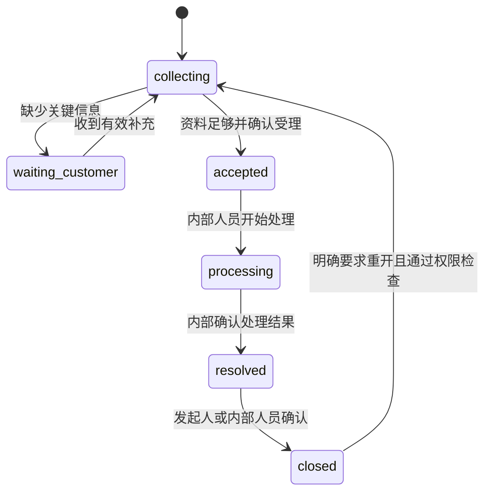

# 企业微信外部客服详细设计

日期：2026-10-04。状态：设计草案，供评审，尚未实施。

上游复核结论（2026-10-04）：上游维护者已明确暂不推进未注册访客调用 agent，详见第 16 节。本文前述方案是 fork 自有扩展，不应当作上游即将提供的功能。第 16 节对复用基线、共享核心改动和实施顺序的修订优先于前文；尚不进入业务实现。

本设计在 Multica 内增加可按机器人启用的外部客服模式，复用企业微信接入、附件、agent、任务队列和 issue。外部用户无需注册 Multica；同群多人、同人多问题分别形成客服工单和独立上下文。内部协作模式继续使用原有账号绑定规则。

## 1. 目标与首版范围

首版必须完成外部身份识别、工单归属、资料收集、受限建单、人工接管、可靠回复和管理界面。外部入口仅处理已经由企业微信推送到服务器的私聊或群内 @ 消息，不承诺读取全部群聊天。

采用以下默认产品规则：

- 群聊默认按发送人独立受理；同人不同问题创建不同工单。
- 其他人可在同群明确提供工单编号后补充资料，但不会自动成为原提问人或获得更多查询权限。
- 已绑定的内部成员在外部客服模式下也走客服流程，不因有 Multica 账号而获得特殊群内命令权限。
- 客服只受理、追问和整理，不分析代码、不连接生产数据库、不自动启动工程 agent。
- 需要技术处理时，由受控服务创建一个内部 issue，分派到管理员配置的项目和内部人员。未配置有效受理人时进入待分派，不猜测或使用旧提示词中的名字。
- 群内回复均视为对全群公开；敏感业务信息不得通过群聊收集或回显。首版不自动把群工单搬到私聊，必要时转人工指定渠道。

本轮不包含独立客服 SaaS、多企业通讯录同步、跨群自动合并、自动修代码、任意知识库检索、客户登录门户及移动端客服管理页面。

## 2. 已确认的现状

代码基线是 feat/goals 的 4d3154335。线上镜像未记录准确提交，以下实现描述以本地基线为准；上线前须完成线上版本与迁移对齐。

| 事实 | 来源与含义 |
| --- | --- |
| 企业微信发送者必须绑定 Multica 用户并属于工作区 | `server/internal/integrations/wecom/wecom_resolvers.go` 的 `ResolveSender` |
| 未绑定消息不会进入 agent | `channel/engine/router.go` 返回 `needs_binding` |
| 群内不同发送者共享群会话 | `wecom_resolvers.go` 将真实 ChatID 作为 BindingKey |
| 底层支持自定义会话隔离键 | `channel/engine/session.go` 已区分 BindingKey 与真实发送地址 |
| 会话与任务身份仍依赖用户 UUID | `ResolvedIdentity.UserID`、`PrepareChatTaskEnqueue`、`task_token.user_id` |
| 普通任务令牌带有内部用户身份 | `middleware/auth.go` 的 mat_ 分支写入用户、agent、task、workspace 身份 |
| 当前解析器没有引用消息 ID 字段 | `wecom/ws_frame.go` 的 `aibotMsgCallback`；首版不能依赖引用定位 |
| 发送 ACK 超时不等于未发送 | `wecom/relay_outbound.go` 已区分未发送与结果不确定，必须保留此语义 |

线上只读调查还确认：客服助手只有 2 个绑定用户，有 15 条 unbound_user 记录；2026-09-23 13:07:41 北京时间的一次绑定提示被企业微信以 846607 限流拒绝。模型网络故障和个人 Mac 离线是另一层问题，不能靠开放访客身份解决。

## 3. 架构与复用边界

新增领域目录 `server/internal/customerservice/`，负责身份、工单、路由、权限策略和回复队列。企业微信适配器只做协议转换及模式分流。通用 channel engine 只增加必要的身份和会话扩展，不植入企业微信客服业务判断。

| 模块 | 处理方式 |
| --- | --- |
| WebSocket 连接、凭证解密、连接租约 | 原样复用，不另起同 Bot ID 的连接 |
| 消息标准化、图片文件下载 | 复用；客服附件增加归属和访问校验 |
| 会话和聊天记录 | 复用存储，通过工单隔离键创建独立会话 |
| 任务排队、重试、运行日志、用量 | 复用；新增外部客服任务来源与授权上下文 |
| 用户绑定 | 内部模式复用；客服模式使用独立外部身份 |
| issue 和分派 | 复用领域服务，入口限于客服工具及内部人员 |
| 对外回复 | 复用底层发送器，新增持久化调度和结果不确定状态 |
| Web、桌面 UI | 在共享 core/views 增加客服列表、详情和配置 |

“专用客服 agent”仍是现有 agent 实体。新增的是受限执行配置和来源上下文，不是第二套 agent 平台。

## 4. 身份、准入与负责人

### 4.1 外部身份

外部身份唯一键为 `(installation_id, channel_user_id)`；群只影响会话范围，不影响同一机器人下的身份识别。显示名只是可修改标签，不能用于身份合并。更换机器人安装不自动合并身份，也不按企业微信昵称或邮箱猜测对应用户。

外部身份不会创建 Multica user/member、没有浏览器登录会话、没有可交给客户的 API token。现有账号绑定若存在，只用于内部显示关联信息，不扩展外部通道权限。

### 4.2 群准入

机器人配置 `access_mode=members_only|customer_service`，默认 members_only。客服模式必须设置允许接入的群；私聊接入单独开关，默认关闭。首次发现的群进入待启用列表，外部用户无法通过发消息自行授权新群。

无法识别合法发送者、群未启用、机器人撤销、访客被禁用时，不进入模型。失败原因记入审计；拒绝提示合并限流，避免对未知来源反复回复。

### 4.3 发起人与内部负责人分离

外部发起人是 visitor，内部负责人是 accountable member。内部负责人提供运营归属和任务费用责任，不代表外部用户拥有该成员权限。

首版保留现有 chat_session.creator_id 作为内部管理归属，同时通过客服元数据记录真实访客。外部任务不得走“发起人为内部负责人”的普通聊天路径，不构造 `DirectHumanRun` 冒充人为发起。需要新增明确的 `external_customer` 来源，并沿排队、领取、重试、审计传递。

内部负责人离开工作区、专用 agent 被归档、群被禁用或客服模式关闭后：新执行和工具调用失败关闭，已接收资料保留，提示内部人员处理；不自动转移到更高权限账号。

## 5. 工单与消息归属

### 5.1 工单是问题单位

客服工单 `support_case` 不等于一次 agent 执行，也不要求立即创建 issue。一个工单可有多轮咨询和运行，首版最多关联一个内部 issue。多个客服工单可以由内部人员显式关联同一个 issue，但不合并外部上下文。

外部编号采用工作区内固定前缀 `CS-` 加递增序号，不随 workspace.issue_prefix 改变。编号是定位信息，不是授权凭证。

会话隔离键：`support:<case_uuid>:<conversation_revision>`。真实安装 ID、群 ID、群类型始终存为单独的发送路由字段，绝不能把合成键传给企业微信发送接口。

### 5.2 确定性路由优先级

| 优先级 | 输入情况 | 行为 |
| --- | --- | --- |
| 1 | 明确包含合法 CS 编号 | 校验机器人、工作区、群及参与权限，再归属该工单；不存在与无权统一提示无法定位 |
| 2 | 明确说“新问题”或客服专用新建指令 | 为该发送者新建工单，不继承其他问题上下文 |
| 3 | 回答最近一次归属选择，且选择仍有效 | 将原待归属消息及附件一起关联所选工单 |
| 4 | 同人同群只有一个 waiting_customer 工单，24 小时内，且内容明确回答该追问 | 作为补充；主题分类器只能返回 continue/new/uncertain，不能指定其他人的工单 |
| 5 | 明确独立的新业务问题 | 新建工单 |
| 6 | 多个候选、图片无说明、主题不确定、已关闭工单无明确编号 | 保留消息并询问：“这是补充 CS-123，还是一个新问题？” |

不使用“最新活跃工单”直接吸收所有消息。话题分类仅看同人同群的候选摘要和待回答字段，不读取其他人的工单正文。模型超时、输出不合法或多个路由线索冲突时进入询问，不猜测。

尚未选择归属的消息也必须持久保存，状态为 awaiting_route，不提前创建多个空工单。选择有效期 24 小时；过期后原消息仍保留供人工分配，新的回复不消费旧选择。

### 5.3 多人共同补充

张三的工单与李四默认隔离。李四明确发送 `CS-123 补充：……` 时，仅允许对当前机器人、当前群的工单添加资料，记录李四为 contributor。

贡献者不能仅凭编号查询完整历史、改变负责人、关闭工单或查询内部 issue。机器人只确认“已补充到 CS-123”，不回显张三的历史信息。跨群、群转私聊、私聊转群均不自动打通；人工可在内部关联，但不会带出原会话数据。

首版不使用企业微信引用消息自动定位。后续如取得并验证稳定的引用字段，可把引用 ID 到工单的映射加入优先级 1；纯引用文本不能当身份或归属证据。

### 5.4 示例

| 场景 | 结果 |
| --- | --- |
| 张三 @ 报价失败，李四同时 @ 无法登录 | 建立两个工单、两个会话，互不共享模型上下文 |
| 张三在报价工单待追问时回答报价单号 | 明确匹配追问后补入原工单 |
| 张三再说“新问题：退款金额不对” | 新工单，不污染报价上下文 |
| 张三有两个工单，只发一张截图 | 保存截图并询问编号，不随机归属 |
| 李四发送“CS-123 我也遇到了，这是截图” | 同群允许追加贡献，不开放张三历史查询 |
| 用户从另一群发送 CS-123 | 拒绝定位，不泄露编号是否存在 |

## 6. 工单状态与人工接管

业务状态与回复投递状态分开存储。

任何未关闭状态均可由内部客服关闭，必须记录原因；非正常迁移由服务端拒绝。客服模型只能推进 collecting、waiting_customer、accepted，不能自行宣称技术问题解决。

`handling_mode=bot|human` 与业务状态独立。人工接管时增加版本号，暂停新模型任务，并使正在运行的旧结果失效；旧任务可取消或仅保留日志，不能覆盖人工回复。恢复机器人需要内部人员明确操作，并从本工单历史生成新的上下文版本。

“已受理”只在 accepted 已提交后发送；“已转交处理”只在内部 issue 创建和分派均成功后发送。任务排队、模型失败、消息发送失败都不能伪装为业务成功。

## 7. 数据模型

以下是逻辑设计；迁移编号在完成线上账本对齐后分配。所有表带 workspace_id（适用处）、创建/更新时间，应用层维护关系，不新增外键和级联删除。所有新索引，包括唯一索引，使用单独 migration 的 CREATE INDEX CONCURRENTLY。

| 表 | 核心字段与约束 |
| --- | --- |
| `support_installation_policy` | installation_id 唯一；mode、agent_id、accountable_user_id、project_id、default_assignee_id、authorized_staff_user_ids、allow_dm、policy_version、enabled_at |
| `support_channel` | installation_id、真实 channel_chat_id、chat_type、enabled；安装与真实会话唯一；保存待启用群元数据 |
| `support_visitor` | installation_id、channel_user_id、display_name、status、可选 linked_user_id；安装与外部用户唯一 |
| `support_case` | id、number、installation_id、channel_id、requester_visitor_id、status、handling_mode、summary、分类、待补充字段、issue_id 可空、chat_session_id、conversation_revision、version |
| `support_case_participant` | case_id、visitor_id、role=requester/contributor、joined_at；工单与访客唯一 |
| `support_message` | 安装、真实会话、发送者、平台 message_id、case_id 可空、chat_message_id 可空、内容与附件引用、route_state、候选编号、选择到期时间、received_at、processing 状态及领取租约；安装与平台消息 ID 唯一 |
| `support_run_context` | task_id 唯一、case_id、外部触发消息及访客、accountable_user_id、mode/policy_version、case_version、输入序号范围、conversation_revision、授权到期时间；重试继承归属但重新校验授权 |
| `support_tool_token` | token_hash 唯一、task_id、case_id、workspace_id、installation_id、policy_version、允许动作、expires_at、revoked_at；不存原始凭证 |
| `support_outbox` | reply_id、case_id 可空、来源消息、真实发送地址、requester 标识、种类、正文、case_version、status、attempt、next_attempt_at、lease、平台结果、错误码；逻辑回复唯一键 |
| `support_case_event` | case_id、actor_kind/actor_id、事件类型、前后状态、原因、关联消息和任务、可选 operation_key 与结果摘要、时间；非空 operation_key 在工作区内唯一，支持工具与人工操作幂等 |

`support_message` 承担持久化入站队列；不是另建一套消息传输。附件二进制继续走原存储，表中只存引用。归属不明确时附件挂在消息上，归属完成后再绑定工单。

工单序号在创建事务内从 policy 所属工作区计数记录原子分配，允许跳号但不重复；实现时复用现有工作区计数设施，若它仅服务 issue，则新增独立 support_case_counter。不能用 SELECT max(number)+1。授权客服名单首版作为有上限的配置集合持久化，每次读写仍重查成员身份；不把已移出的成员继续视为客服。

索引至少覆盖：安装与发送者查找、安装与消息去重、工作区与工单编号唯一、工作区状态列表、同群同人活跃工单、待领取入站消息、待发送 outbox、工单时间线。创建唯一索引前验证数据；索引建立完成后才能启用客服模式。

删除工作区时将以上表注册进 workspace deletion manifest，按消息、执行上下文、回复、事件、参与者、工单、访客和配置的依赖顺序清理，并沿用附件对象回收机制。撤销安装只停接入，默认保留工单；显式数据清理按现有管理员权限执行。

专用 token 先撤销再清理，计数记录随工作区删除。首版不自动删除仍待归属或未关闭工单资料；关闭后的保留策略沿用部署的数据政策，未配置时保留，管理界面明确显示该默认值，禁止静默丢弃附件。

## 8. 事务、并发与模型上下文

### 8.1 接收事务

确认消息来自当前已验证的企业微信连接后，校验安装和群准入，upsert visitor，按平台消息 ID 插入 support_message 并完成去重记录。只有持久化完成后才视为接收成功。

崩溃恢复从 pending/租约过期待处理消息继续，不依赖进程内 timer。内容、附件下载和模型请求不放在长数据库事务内。被拒绝消息只存必要的审计信息，不保存无关客户正文。

### 8.2 路由与工单创建事务

路由 worker 先领取消息，在 `(installation, real_chat, visitor)` 范围串行化归属；进入确定工单后锁工单并重新检查版本。新建工单、参与者、chat session/binding、消息关联在一个事务内提交。模型辅助判断在事务外执行，提交时检查候选版本，过时则重判或询问。

同一消息只关联一个工单。一个工单首版只允许一个活动 agent run；新消息按 received_at 与稳定 ID 排序进入下一批。不同工单可并行，共用 agent 的并发上限。短时合并只在同工单进行，不能按整个群合并输入。

路由分类器使用服务器侧的无工具模型调用，只获得当前访客的候选摘要，不能创建 issue、访问账号应用或发消息。模型不可用时保留 deterministic 路由和归属询问；在未配置该能力时，除编号、显式新问题和严格可匹配的追问回答外，均询问后再继续。

### 8.3 会话权限与上下文

每个 run 只获取当前工单的公开消息、参与者标识、摘要、附件和允许公开的状态；不加入整群历史、内部 issue 评论、其他工单或管理员私人 MCP。

消息显示发言人时采用服务器提供的可信身份标签，正文中自称管理员不能改变 actor。首次外部输入、模型产物、内部备注与对外批准内容都有不同来源标签。

内部会话列表、搜索、WebSocket 订阅、附件下载和日志查看都检查客服访问权限，不能因为复用了 chat_session 就让普通工作区成员看到所有客户信息。普通聊天路由不得给客服会话直接创建无约束任务。

实现上给 session 的低层写入方法增加明确的客服来源参数与事务校验，在 support_message 中记录真实 sender；不把外部 visitor UUID 塞进 user_id。既有成员路径继续传 UserID；外部路径使用经过校验的 support_run_context。上下文创建、附件 uploader 归属与任务审计中可以记录内部负责人为管理责任人，但展示与授权均不得把他当作消息作者。现有 binding 的 config 必须保存真实发送地址；所有客服回复只走 support_outbox，并在旧的 wecom task-completion/inbox 回传入口排除此类任务，避免双重回复。

### 8.4 模型完成事务

验证 task 与工单、输入批次、policy_version、人工接管版本一致后，提交结构化字段更新、受理状态和对外 outbox。旧 run 结果过期时保留审计，不发送；关闭工单或人工接管后旧回复不得迟到。

## 9. 执行权限与工具

外部客服任务不是普通成员 task token 的低权限提示词版本。现有 mat_ 路径关联内部用户，不能直接复用为访客工具凭证。

新增客服专用短期不透明凭证（建议独立前缀 `msc_`，落库仅保存 hash），绑定 workspace、installation、case、task、policy_version、有效期和允许动作。凭证仅交给执行环境，不交给企业微信用户。首版有效期 15 分钟且不超过任务时限，任务终止立即撤销；续期仅由有效任务领取流程执行。

只有 `/api/customer-service/tools/*` 接受该凭证；通用认证明确拒绝它，客服工具中间件也拒绝伪造的 X-User-ID/X-Task-ID。工具从凭证推导 case，不接受模型任意指定工作区或他人工单。

允许的工具：

| 工具 | 服务端限制 |
| --- | --- |
| 读取当前工单上下文 | 只返回当前工单公开字段与当前允许附件 |
| 更新收集字段 | 允许分类、摘要、缺失信息；不能改 requester、群、负责人或授权 |
| 提交受理 | 校验必需字段；每工单幂等；只更新客服状态 |
| 请求创建内部 issue | 使用配置项目与内部受理人，服务端调用现有 issue 服务；每工单最多一次；不启用工程 agent |
| 提交对外回复 | 写入 outbox，不直接操作企业微信；正文不包含内部链接/日志/令牌 |

工具操作使用 `(task_id, action_id)` 幂等键；内部 issue 创建、关联 support_case 和审计同事务提交。若现有服务不支持该事务，则先抽出最小事务接口，不能用“建单成功但关联失败后重建”补救。

一个 action_id 携带的参数摘要必须固定：同键同参数返回先前结果，同键不同参数返回冲突。support_case.issue_id 的工单级防重仍生效，不能靠换 action_id 重复建单。工具服务每次重查工单与安装策略，令牌尚未过期也不能绕过人工接管、停用或授权撤销。

禁用普通 Multica CLI 凭证、成员连接应用、内部技能自动注入、个人 MCP、生产密钥和仓库挂载。客服运行在专用 daemon/容器，任务临时目录按工单隔离，只能访问模型服务、受限工具服务和授权附件下载。CLI 自身可能带 shell 能力，因此“工具列表较少”不等于隔离；容器文件、凭证与网络限制是启用外部模式的前提。

队列和执行日志继续复用，但领取外部任务时使用独立授权分支，不调用普通成员 `PrepareChatTaskEnqueue` 来借用权限。任务、重试与 daemon payload 必须显式保留 external_customer 来源和 support_run_context。不能识别该来源的旧 daemon 不允许领取此类任务；缺失隔离能力时启用检查失败。

## 10. 对外回复与故障恢复

所有客服回复固定携带 CS 编号；新工单首条回复使用“CS-123 已收到报价问题，正在整理”。显示名可用时附提问人标签；真实 @、原生引用等能力未验证前不作为首版承诺。

发送器只读取 outbox 保存的真实群/私聊地址和安装，不能读取后续消息改变的“最近群地址”。同机器人下受理、进度、系统通知共享限流预算；优先发送客户直接请求的回复，对无关工作区通知聚合或停用，避免再次挤占客服配额。

| 状态 | 处理 |
| --- | --- |
| pending / retry_wait | 到期领取并发送；同逻辑回复唯一 |
| sending | 带租约；崩溃后依据是否已写入 socket 判断，不能一律重发 |
| sent | 仅明确成功 ACK 后确认；不等于用户已阅读 |
| delivery_unknown | 写入 socket 后 ACK 超时或崩溃，可能已经送达；首版不自动重发，管理页可核实后人工重发并记录原因 |
| failed | 永久拒绝或超过预算，进入人工待处理 |
| cancelled | 工单关闭、人工接管或权限撤销后失效的旧回复 |

对明确限流拒绝（如 846607）按退避加随机抖动重试；优先使用服务端提示的等待时间，否则采用可配置的 5 秒到 5 分钟退避，首版最多 8 次/30 分钟。这是本系统初始策略，不是企业微信官方配额声明。发送不确定与明确拒绝必须分别处理，不能承诺端到端恰好一次。

模型不可用时仍先持久接收资料，只尝试一次合并后的“已收到，稍后处理”提示，业务状态保持待处理；超时后转人工。机器人离线、配额耗尽、模型 403 和消息发送限流使用不同错误类别，管理页可直接看到故障所在层。

## 11. API 与界面

内部管理 API 使用现有成员认证与 X-Workspace-ID，路径统一为 `/api/customer-service`。owner/admin 可配置和授权客服人员；被授权客服可处理工单，普通成员无默认访问权。

| API | 行为 |
| --- | --- |
| GET/PATCH `/installations/{id}/policy` | 查看/修改模式、专用 agent、负责人、项目、私聊准入；PATCH 使用版本检查 |
| GET `/installations/{id}/channels` | 显示发现的群及启用状态，不展示 Bot secret |
| PATCH `/channels/{id}` | 启用/停用群；管理员操作 |
| GET `/cases` | 按状态、群、负责人查询，游标分页 |
| GET `/cases/{id}` | 返回工单、公开对话、内部备注和投递状态，权限分别校验 |
| POST `/cases/{id}/replies` | 人工对外回复；需明确 external 可见性及幂等键 |
| POST `/cases/{id}/notes` | 内部备注，永不自动外发 |
| POST `/cases/{id}/handoff` | 人工接管/恢复 bot，检查 version |
| POST `/cases/{id}/issue` | 人工建内部 issue 或关联已有 issue，校验同工作区与权限 |
| PATCH `/cases/{id}` | 受限状态及负责人变更，不允许任意改群/发起人 |
| POST `/messages/{id}/assign` | 人工为待归属消息指定工单，限制同安装同群 |
| POST `/outbox/{id}/retry` | 对 failed/unknown 人工重发，校验版本并明确重复风险 |

外部用户不直接访问这些 API，所有用户动作来自验证过的企业微信消息。客服工具 API 与内部管理 API 分开注册和授权。

共享 UI 放在 `packages/views/customer-service/`，hooks、schemas、API client 放在 `packages/core/customer-service/`；Web 和 Desktop 都添加路由，服务端 capability `customer_service_supported` 缺失时隐藏入口。

首版页面包含：

1. agent 企业微信设置中的接入模式与启用检查，旧成员模式默认不变。
2. 客服列表：编号、群、发起人、摘要、业务状态、bot/human、关联 issue、最后活动和发送异常。
3. 工单详情：独立对话、参与者、资料摘要、内部备注、关联 issue、人工接管和回复。
4. 待归属/异常列表：无法确定工单的消息、附件失败、模型失败、投递未知。

内部备注编辑框和“发送到企业微信群”编辑框明确区分；发送前固定显示目标群与 CS 编号。普通内部评论不自动回传。服务端结构化事件使 React Query 按 workspace/case 定位失效，不把工单服务端状态复制到 Zustand。

## 12. 发布、数据迁移与回退

现网 Goals 迁移记录是 451–468，而本地是 456–473；不能直接部署本地最新后端并让它自行重放全部迁移。

实施前建立线上迁移账本、实际 schema 与候选镜像的对照。在隔离数据库恢复备份后验证既有 Goals 对象和新的客服迁移；通过后制定单独的、可审计的对齐方案。禁止仅凭编号批量篡改 migration 记录。

发布步骤：

1. 明确部署基线、数据库备份和恢复验证；镜像记录 commit 与不可变标签。
2. 部署新增表和后端能力，所有安装保持 members_only。
3. 部署共享 UI 与专用客服 daemon，验证凭证、环境和出站访问限制。
4. 配置内部负责人、受理人、目标项目和一个测试群，关闭该机器人的无关通知广播。
5. 将该机器人切为 customer_service；原群聊天记录保留只读，新的客服工单不继承旧群共享上下文。
6. 用真实测试用户执行外部验收后，再逐群启用。旧版桌面端继续使用已有功能。

回退优先关闭客服模式与暂停外部任务、回复队列，保留已接收消息和工单供内部处理。恢复成员模式不会自动把访客消息注入旧群会话，也不会重发 pending 回复。日常回退不删除新表；不在存在客服数据时执行破坏性 down migration。

## 13. 验收与测试矩阵

| 范围 | 必须通过的场景 |
| --- | --- |
| 身份与准入 | 无账号用户成功受理；旧成员模式仍要求绑定；昵称相同不混人；禁用群/访客不执行 |
| 多人隔离 | 两人同时 @ 产生独立工单；附件、模型上下文、输出地址互不混用 |
| 同人多问题 | 显式新问题建新工单；多个候选发截图先询问；超期选择不误消费 |
| 共同补充 | 同群编号可补充；贡献者不能读历史或关闭；跨群编号不泄露存在性 |
| 并发与幂等 | 同消息多次回调只存一次；同时创建不产生重复工单；工具重试不重复建 issue |
| 崩溃恢复 | 收到消息后、入队前、工具提交后、写 socket 后分别模拟崩溃；可恢复或标记 unknown |
| 权限 | msc_ 不能访问普通 API；伪造头/其他 case 被拒绝；不注入负责人 MCP；不能经普通聊天路由绕过 |
| 执行隔离 | 无仓库/生产密钥；跨工单文件不可读；网络限制生效；旧 daemon 拒收 |
| 生命周期 | 人工接管阻断旧回复；撤销策略后任务工具失效；内部负责人退出后失败关闭 |
| 回复 | 明确限流退避；ACK 超时不盲重发；回复固定群和编号；内部备注永不自动外发 |
| 数据 | 附件未归属仍保留；workspace 删除无残留；所有索引符合并发构建规范 |
| 客户端 | Web/Desktop 均可受理；旧服务器无 capability 隐藏入口；畸形 API 响应安全降级 |
| 现网升级 | 从现网备份恢复后迁移通过，原 Goals、内部 agent 和成员绑定回归正常 |

单元测试覆盖路由和状态机；数据库集成测试覆盖事务、唯一键、越权和恢复；HTTP/daemon 测试覆盖令牌及执行来源；UI 测试覆盖人工接管和发送目标；真实企业微信群验证限流、图片、多人交错和实际投递能力。没有运行真实测试前，不把平台引用、@ 或消息重试语义描述为已验证。

初始运行目标：持久接收正常负载 p95 小于 2 秒；非模型路由 p95 小于 1 秒；模型首轮目标 30 秒以内，120 秒无结果转待人工。以上是待压测的服务目标，不是当前性能结果。

监控记录入站拒绝原因、待归属积压、工单串行等待、模型失败分类、限流次数、投递未知和人工接管。日志携带 installation/case/message/task/reply 关联 ID，不记录 Bot secret、凭证、原始下载签名或客户完整正文。

## 14. 开发顺序与规模判断

这是中等规模的业务能力改造，不是单纯删除账号校验；困难集中在任务身份、权限边界和可靠消息归属。

| 阶段 | 可交付结果 | 进入下一阶段条件 |
| --- | --- | --- |
| A 基线与执行验证 | 现网迁移对照；专用执行环境和凭证隔离技术验证 | 外部输入无法使用内部账号权限，恢复库迁移可重复 |
| B 接收与工单 | 身份、准入、持久消息、工单路由、独立会话 | 多人交错和崩溃恢复测试通过 |
| C 受理与回复 | 受限工具、issue 对接、outbox、人工接管 | 越权、重复建单、限流和未知投递测试通过 |
| D 管理与上线 | Web/Desktop 页面、监控、灰度和回退 | 测试群完成端到端验收 |

若 A 阶段发现现有 daemon 无法可靠隔离凭证与环境，替代方案是本项目内增加受限模型执行适配器，仍复用工单、队列及日志，不把外部流量临时交给个人 Mac 上的普通 Codex。具体排期应在 A 完成后按工作量估算，不用未经验证的天数承诺上线。

## 15. 本次设计自检

- 外部身份不借用内部用户权限；内部负责人仅用于归属。
- 群、用户和工单分别建模，工单编号不充当权限凭证。
- 接收确认、业务受理、模型执行和消息投递是不同状态。
- 平台引用和真实 @ 没有证据，不纳入首版依赖。
- 明确拒绝可重试，投递未知需核实，避免承诺恰好一次。
- 现有内部功能默认不变；现网 migration 差异是发布前置工作。
- 待产品评审的默认规则是“同群明确编号可共同补充”；无需等待该选择即可评审其余技术设计。

## 16. 上游方向复核与设计修订

### 16.1 调查范围与基线

GitHub 确认 jlinux/multica fork 自 multica-ai/multica。2026-10-04 查询的上游 main 为 `b4ca5b4a23e68b26292a680dca7689a952bb1cd5`，提交时间为当天 04:48:20 UTC。通过 GitHub API 核对现行代码、相关 issue、PR、评审和关闭说明。Git fetch 在传输阶段超时，未合并上游到本地；main 代码检查使用 GitHub contents API 完成。

### 16.2 外部访客接入不是当前已接受的上游方向

- [Issue 6411](https://github.com/multica-ai/multica/issues/6411#issuecomment-5202134185)：用户提出让没有 Multica 账号的朋友通过飞书或企业微信使用 agent；维护者在 2026-08-06 说明成员限制是有意设置的访问边界，并以 not planned 关闭。
- [PR 6986](https://github.com/multica-ai/multica/pull/6986#issuecomment-5408595203)：曾实现按 agent 开启同租户飞书访客接入。早期评审认可受限咨询方向，但后续内部讨论改变了决策；2026-08-25 的最终关闭说明明确暂不推进，原因是访客输入会到达带有本机文件、shell 和凭证的运行时。维护者表示只有具备脱离用户本机的隔离执行环境、不携带工作区凭证、按访客配额与限流后才会重新考虑。该回复也明确当时没有覆盖此场景的内部设计。
- [PR 8838](https://github.com/multica-ai/multica/pull/8838)：2026-09-27 已合并，对已绑定工作区成员进一步检查是否有权调用 agent。最新 main 仍先做身份绑定与成员校验，再做 MemberMayInvokeAgent。

因此，不能等待上游升级解决外部接入，也不能把移除绑定检查视作与上游兼容的小修。这里的结论限定于截至调查日的公开证据，不断言上游未来永不支持。

### 16.3 上游可以复用的相关能力

| 工作 | 调查日状态 | 对本方案的影响 |
| --- | --- | --- |
| [PR 7978 企业微信群按发送者隔离](https://github.com/multica-ai/multica/pull/7978) | OPEN，存在合并冲突，无正式 review | 提供 group chatid:senderid 与真实出站地址分离的实现参考；不能当作已发布能力，仍不解决同人多问题或访客授权 |
| [PR 7980 读取引用内容](https://github.com/multica-ai/multica/pull/7980) | 2026-09-17 MERGED | 应复用引用正文处理；引用内容仍不提供可验证的原消息 ID/作者，不能据此跨用户合并工单 |
| [PR 8355 原消息内回复](https://github.com/multica-ai/multica/pull/8355) | 2026-09-21 MERGED | 已有按运行关联消息气泡的能力；避免重做，但它仍是 best effort，不替代持久工单和投递记录 |
| [PR 8345 出站节流与有限重试](https://github.com/multica-ai/multica/pull/8345) | 2026-09-15 MERGED | 复用 rate gate，客服 outbox 补持久化层；该实现识别 45009/45033，不能据此宣称现网 846607 已覆盖 |
| [Issue 2990 Web UI Guest mode](https://github.com/multica-ai/multica/issues/2990) | OPEN | 提议只读网页访问，不是访客通过 IM 执行 agent |

### 16.4 对本设计的具体调整

1. 先在隔离环境评估同步上游基础改进和 Goals 迁移兼容性，再决定移植哪些提交；本轮不升级线上。
2. 保留本设计中的访客、群准入、工单路由和人工处理模型，但将其明确标注为自有客服扩展。
3. “复用全部普通 agent 执行链路”降为待验证项，不能为了复用而大面积修改上游 UserID、任务归因及权限模型。优先评估本项目内独立客服执行适配器，或独立部署的隔离客服 worker，通过受限内部接口创建 issue；它们都不等于另造一套任务管理系统。
4. 现有 Bot ID 仅有一个连接所有者。若隔离 worker 独立部署，由本项目现有适配器转交标准化消息并回传结果，不能让两套进程同时连接同一机器人。
5. 外部执行环境、访客配额、入站限流和成本上限是开启条件。第 9 节的 msc_ 只限制工具 API，不能代替环境隔离。启用时必须配置每访客/群/安装的限额，超额消息可记录但不得产生模型调用；不能只限制回复发送频率。
6. 上游复用点、有限接入改动、自有业务模块分别维护提交，建立对 upstream/main 的定期兼容检查；任何通用修复若拟回馈上游，先单独验证其是否适合上游范围，不默认本客服功能可被上游接受。

本次调查改变的是扩展边界和长期维护判断：继续复用 Multica 的渠道与工单管理能力，但不再以扩展共享成员权限/普通 daemon 为默认执行路线。最终执行适配选择需完成隔离与接口技术验证后锁定。
